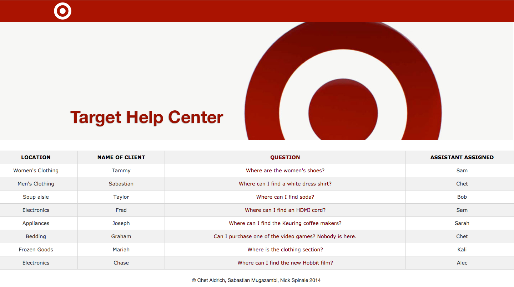

Target Help
============

Top 20, UHack (University of Minnesota Hackathon 2014) 

This help center-like web application was designed to provide a quick, simple interface
by which customers could quickly ask questions of staff via text and get them answered quickly.

The interface uses a combination of the Flask web framework and Twilio API, and was built in 24 hours
for UHack at the University of Minnesota. The project reached the second round of judging, which comprised
of the top twenty entries at the hackathon.

Dependencies
------------
1. Python (pip)
2. Virtualenv
3. Flask
4. Twilio python library

Take a look at [this website](http://flask.pocoo.org/docs/0.10/installation/) to install flask and the associated venv environment.

Created with [Nick Spinale](https://github.com/nickspinale) and [Sabastian Mugazambi](https://github.com/SabastianMugazambi).
